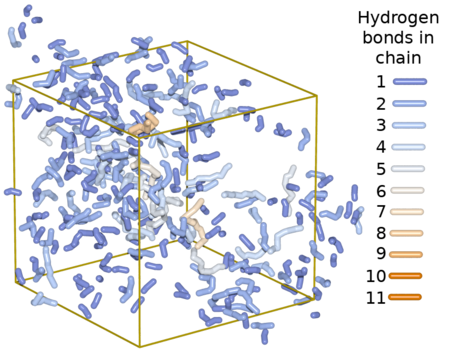

TraceHBonds
=====

# Contents

  * [Installation](#installation)
  * [Usage](#usage)
  * [Output](#output)
      * [Hydrogen bond strings](#sizehist)
          * [Generating Images](#generating-image)
      * [Neighbor distance in chains](#neighborhist)
      * [Hydrogen bond lengths](#lengths)
      * [Hydrogen bond angles](#angles)
      * [Hydrogen bond lifetime correlations](#lifetime)

# Installation

```bash
$ mkdir build
$ cd build
$ cmake -DCMAKE_BUILD_TYPE=release ..
$ make
$ src/TraceHBonds
```

To generate the documentation as html, available at `docs/html/index.html`, use

```bash
$ make docs
```

To cross-compile, use:

```bash
$ cmake -DCMAKE_BUILD_TYPE=release -DCMAKE_TOOLCHAIN_FILE=<Toolchain cmake file> ..
```

# Usage

And example command line would be:

```bash
TraceHBonds --input molecule.arc -p HBonds -s .dat -H h1o -A o2h -r 2.5 -a 90.0 --verbose --all
```

Below is a table of all options available from the command line. The long form options
are preceded with `--`, and short form `-`. For options with both a long and
short form, either one may be used on the command line.


|Long form | Short form |Option Type    | Required? | Description |
|:---------|:----------:|:--------------|:---------:|:------------|
|input     | i          | string        | yes       |The archive file generated from Discover. |
|outprefix | p          | string        | yes       |All output will have this string as a prefix to the filenames. For example, to save data as `HBonds1.dat`, use `-p HBonds` as the prefix|
|outsuffix | s          | string        | yes       |All output will have this string as a suffix to the filenames. For example, to save data as 'HBonds1.dat', use `-s .dat` as the suffix|
|rcutoff   | r          | real number   | yes       | Set the cutoff length, in angstroms, for the determination of a hydrogen bond. |
|anglecutoff| a         | real number   | yes       | Set the cutoff angle, in degrees, for the determination of a hydrogen bond.|
|hydrogen  |H           | string        | yes       | Set the force field of donor hydrogens for hydrogen bonding (e.g. -H h1o). More than one force field may be used by specifying additional -H force field parameters.  **NOTE** the short option is a capital 'H.'|
|acceptor  |A           | string        | yes       | Set the force field of acceptor atoms for hydrogen bonding. More than one force field may be used by specifying additional -A force field parameters (e.g. -A o2h -A o1=). **NOTE** the short option is a capital 'A.'|
|bins      |b           | integer       | no        | Minimum number of bins to show in histograms.|
|povray        <a name="povray-t"></a>      |            |               | no        | Output in povray format, relevant for --sizehist only.|
|verbose   |            |               | no        | Show verbose messages while running. |
|brief     |            |               | no        | Show brief messages while running. |
|lifetime      <a name="lifetime-t"></a>    |            |               | no        | Calculate hydrogen bond lifetime correlations. |
|lengths       <a name="lengths-t"></a>     |            |               | no        | Save length of all hydrogen bonds.|
|angles        <a name="angles-t"></a>      |            |               |           | Save angle of all hydrogen bonds. |
|sizehist      <a name="sizehist-t"></a>    |            |               | no        | Save hydrogen bond strings and histograms. |
|neighborhist  <a name="neighborhist-t"></a>|         |               | no        | Save neighbor length lists. |
|all       |            |               | no        | Do all calculations and save all data. |
|help      | h          |               |           | This help screen |

# Output

Depending upon the command line options, many data files may be generated.
The description of all calculations are listed below

  - [Hydrogen bond strings (--sizehist)](#sizehist)
    - [List of Files Created](#sizehist-files)
  - [Neighbor distance in chains (--neighborhist)](#neighborhist)
    - [List of Files Created](#neighborhist-files)
  - [Hydrogen bond lengths (--length)](#lengths)
    - [List of Files Created](#lengths-files)
  - [Hydrogen bond angles (--angles)](#angles)
    - [List of Files Created](#angles-files)
  - [Hydrogen bond lifetiem correlations (--lifetime)](#lifetime)
    - [List of Files Created](#lifetime-files)

## <a name="sizehist"></a>Hydrogen bond strings (--sizehist)

The [--sizehist](#sizehist-t) option calculates hydrogen bonds, traces the
hydrogen bonds into connected strings, and tabulates the sizes.

### <a name="sizehist-files"></a>Files Created

 - \<prefix\>#\<suffix\>

Where _#_ indicates the frame of the trajectory. For a trajectory containing
100 frames, 100 files will be generated.

### Description of files

The files generated from the [--sizehist](#sizehist-t) option consist of two parts:
the [individual chains](#individual-chains) and their atoms, and [histograms
of chain sizes](#chain-histograms).

#### Individual Chains

As an example, a few lines from a data file follows, showing 3 chains.

~~~~~~~~~~~~~
# Current Element : 589
# Atoms in Chain : 3
# Molecules : 2
# Unique forcefields : 3
# Times chain switched between Molecules (switching) : 1
# Periodic boundary conditions applied.
  21.6276   27.0261   44.9056 [O]  Molecule  O87  o2h
  21.3585   27.9405   44.8265 [H]  Molecule  H592  h1o
  20.1321   29.5776   43.8281 [O]  Molecule2  O1493  o1=
# Chain end-to-end distance: 3.147660


# Current Element : 590
# Atoms in Chain : 9
# Molecules : 2
# Unique forcefields : 3
# Times chain switched between Molecules (switching) : 1
# Periodic boundary conditions applied.
  24.6835   23.4992   41.1162 [O]  Molecule  O95  o2h
  24.2312   22.9546   41.6786 [H]  Molecule  H601  h1o
  23.0622   23.9573   43.4825 [O]  Molecule  O88  o2h
  22.4585   23.9183   44.2600 [H]  Molecule  H593  h1o
  21.5617   24.1262   45.5633 [O]  Molecule9  O8207  o2h
  21.6362   24.7840   46.3132 [H]  Molecule9  H8711  h1o
  22.6499   25.4540   47.5703 [O]  Molecule9  O8208  o2h
  23.5335   25.7281   47.6493 [H]  Molecule9  H8712  h1o
  25.0893   24.1132   46.6706 [O]  Molecule9  O8209  o1=
# Chain end-to-end distance: 5.602967


# Current Element : 591
# Atoms in Chain : 5
# Molecules : 2
# Unique forcefields : 2
# Times chain switched between Molecules (switching) : 1
# Periodic boundary conditions applied.
  28.8885   22.9984   40.5006 [O]  Molecule  O96  o2h
  29.6141   22.3548   40.3725 [H]  Molecule  H602  h1o
  30.7792   21.1779   38.8075 [O]  Molecule6  O5419  o2h
  31.6526   21.1038   39.2359 [H]  Molecule6  H5925  h1o
  33.3777   21.2051   38.4486 [O]  Molecule6  O5420  o2h
# Chain end-to-end distance: 5.251614
~~~~~~~~~~~~~

If the [--povray](#povray-t) option is used, then the same hydrogen bond chains would
look like this:

```
// Current Element : 1
// Atoms in Chain : 3
// Molecules : 2
// Unique forcefields : 3
// Times chain switched between Molecules (switching) : 1
// Periodic boundary conditions applied.
sphere_sweep {
	linear_spline
	3,
	<  21.6276,   27.0261,   44.9056>,ChainRadius
	<  21.3585,   27.9405,   44.8265>,ChainRadius
	<  20.1321,   29.5776,   43.8281>,ChainRadius
	tolerance 0.07
	texture{ChainLength3}
}
// Chain end-to-end distance: 3.147660


// Current Element : 2
// Atoms in Chain : 9
// Molecules : 2
// Unique forcefields : 3
// Times chain switched between Molecules (switching) : 1
// Periodic boundary conditions applied.
sphere_sweep {
	linear_spline
	9,
	<  24.6835,   23.4992,   41.1162>,ChainRadius
	<  24.2312,   22.9546,   41.6786>,ChainRadius
	<  23.0622,   23.9573,   43.4825>,ChainRadius
	<  22.4585,   23.9183,   44.2600>,ChainRadius
	<  21.5617,   24.1262,   45.5633>,ChainRadius
	<  21.6362,   24.7840,   46.3132>,ChainRadius
	<  22.6499,   25.4540,   47.5703>,ChainRadius
	<  23.5335,   25.7281,   47.6493>,ChainRadius
	<  25.0893,   24.1132,   46.6706>,ChainRadius
	tolerance 0.07
	texture{ChainLength9}
}
// Chain end-to-end distance: 5.602967


// Current Element : 3
// Atoms in Chain : 5
// Molecules : 2
// Unique forcefields : 2
// Times chain switched between Molecules (switching) : 1
// Periodic boundary conditions applied.
sphere_sweep {
	linear_spline
	5,
	<  28.8885,   22.9984,   40.5006>,ChainRadius
	<  29.6141,   22.3548,   40.3725>,ChainRadius
	<  30.7792,   21.1779,   38.8075>,ChainRadius
	<  31.6526,   21.1038,   39.2359>,ChainRadius
	<  33.3777,   21.2051,   38.4486>,ChainRadius
	tolerance 0.07
	texture{ChainLength5}
}
// Chain end-to-end distance: 5.251614
```

The `Current Element` numbers are different because they are assigned by
threads, and depend upon the order in which they finish.

##### Generating Image

The program [POV-Ray](http://www.povray.org) can be used to convert the
output of [--sizehist](#sizehist-t) [--povray](#povray-t) to an image or
even a movie of the image rotating. Here is an example image using the
[prettybox.pov](povray/prettybox.pov) script in the [povray](povray/) directory for colorings and shapes:

<div style="text-align:center" markdown="1">

</div>

#### Chain Histograms

This histogram shows how many chains of a specific length there are in this
frame. It also shows how many loops are closed, the begin and end at the
same hydrogen bond. This particular data had no closed loops.

```
# Atoms/HBonds |Count| (For all Chains, including Closed Loops)
#    3 /   1   |  175|**************************************************************
#    5 /   2   |   72|**************************
#    7 /   3   |   19|*******
#    9 /   4   |   16|******
#   11 /   5   |    7|**
#   13 /   6   |    1|
#   15 /   7   |    1|
#   17 /   8   |    1|
#
# Atoms/HBonds |Count| (For Closed Loops)
#
```

The next series of histograms show how many times a hydrogen bond chain switches to
another molecule, for each chain length. Switching of 0 means the chain was
on a single molecule. Switching of 1 means it started on a molecule and
ended on another. The switching number does not indicate how many molecules
a chain is composed of, since it may switch back and forth between two
molecules multiple times.

```
# Switching |Count| (For Chain length of 3)
#    0      |  107|**************************************************************
#    1      |   68|***************************************
#
# Switching |Count| (For Chain length of 5)
#    0      |   18|************************
#    1      |   46|**************************************************************
#    2      |    8|***********
#
# Switching |Count| (For Chain length of 7)
#    0      |    8|**************************************************************
#    1      |    6|***********************************************
#    2      |    5|***************************************
```

The following histograms shows how many molecules a chain is composed of,
for each chain length.

```
# Molecules |Count| (For Chain length of 3)
#    1      |  107|**************************************************************
#    2      |   68|***************************************
#
# Molecules |Count| (For Chain length of 5)
#    1      |   18|**********************
#    2      |   50|**************************************************************
#    3      |    4|*****
#
# Molecules |Count| (For Chain length of 7)
#    1      |    8|**************************************************************
#    2      |    8|**************************************************************
#    3      |    3|***********************
```


## <a name="neighborhist"></a>Neighbor Distance in chains (--neighborhist)

The [neighborhist](#neighborhist-t) option calculates the distance between non-hydrogen atoms
in the hydrogen bond chains. For a chain consisting of only oxygen and
hydrogen atoms, this would calculate the neighbor distances between oxygen
atoms in the chain.

### <a name="neighborhist-files"></a>Files Created

  - \<prefix\>-NN-AllFrames\<suffix\>
  - \<prefix\>-NN-Combined\<suffix\>
  - \<prefix\>-NN-only\<suffix\>

All files contain tab delimited text.

### Description of files

The data start with statistics of each individual frame in a
trajectory (NN-AllFrames), then all frames together (NN-Combined), followed
by combining all chain lengths together for a list of only neighbor
distances (NN-only).

#### NN-AllFrames

The table in this file consists of a Count, Average, and StdDev column for
each frame of the trajectory, so the table can have many columns if a
trajectory with many frames is used.  It's not uncommon to read 100, 1000,
or more frames. Sample output is shown below, in table format for easy
viewing.  **Note**: Only the first 2 off 1000 frames of a large trajectory
file are shown, and the first 13 of 27 atoms in chain for this particular
sample trajectory file.

n.n. = Nearest neighbor, and f is the frame number.

|Atoms in chain | Nth n.n. |Count(f=0) |Average(f=0)  |StdDev(f=0)   |Count(f=1) |Average(f=1)  |StdDev(f=1)   |
|:--------------|:--------:|:----:|--------:|--------:|:----:|--------:|--------:|
|3              |    1     |  175 |2.76054  |0.193364 |181   |2.74879  |0.189819 |
|               |          |      |         |         |      |         |         |
|5              |    1     |  144 |2.75077  |0.197673 |154   |2.76424  |0.204004 |
|               |    2     |  72  |4.75806  |0.635903 |77    |4.64895  |0.732237 |
|               |          |      |         |         |      |         |         |
|7              |    1     |  57  |2.7841   |0.201227 |60    |2.75164  |0.22737  |
|               |    2     |  38  |5.01798  |0.581104 |40    |4.78955  |0.619429 |
|               |    3     |  19  |6.88486  |0.948441 |20    |6.28423  |1.4411   |
|               |          |      |         |         |      |         |         |
|9              |    1     |  64  |2.7419   |0.195794 |52    |2.75299  |0.217351 |
|               |    2     |  48  |4.70959  |0.743358 |39    |4.64655  |0.670621 |
|               |    3     |  32  |6.49354  |1.32184  |26    |6.21771  |1.27282  |
|               |    4     |  16  |8.07276  |1.88673  |13    |7.66016  |2.06277  |
|               |          |      |         |         |      |         |         |
|11             |    1     |  35  |2.69268  |0.130133 |25    |2.69679  |0.159238 |
|               |    2     |  28  |4.6182   |0.587221 |20    |4.7146   |0.696855 |
|               |    3     |  21  |6.43492  |0.672441 |15    |6.60273  |1.07617  |
|               |    4     |  14  |8.2164   |1.09446  |10    |8.3314   |1.70064  |
|               |    5     |  7   |9.65632  |1.52155  |5     |9.95754  |2.07065  |
|               |          |      |         |         |      |         |         |
|13             |    1     |  6   |2.76977  |0.150354 |12    |2.78778  |0.272727 |
|               |    2     |  5   |4.82386  |0.386727 |10    |4.65379  |0.546978 |
|               |    3     |  4   |6.49485  |0.499925 |8     |6.08429  |0.413477 |
|               |    4     |  3   |8.00401  |0.466091 |6     |7.38176  |1.13275  |
|               |    5     |  2   |9.38291  |0        |4     |8.29956  |2.52054  |
|               |    6     |  1   |9.95807  |0        |2     |9.34289  |0        |

#### NN-Combined

The table in this file combines data from all the frames into single
Count, Average, and StdDev columns. Sample data is shown below, in table
format for easy viewing.  **Note**: Only the first 13 of 27 atoms in a chain
are shown for this particular sample trajectory file.

|Atoms in chain | Nth n.n. | Count|  Average|StdDev  |
|:--------------|:--------:|:----:|--------:|-------:|
|3              |    1     |22655 |2.86888  |0.159418|
|               |          |      |         |        |
|5              |    1     |22230 |2.86208  |0.159733|
|               |    2     |11115 |4.68886  |0.70739 |
|               |          |      |         |        |
|7              |    1     |19182 |2.85872  |0.159745|
|               |    2     |12788 |4.67906  |0.703396|
|               |    3     |6394  |6.07321  |1.31757 |
|               |          |      |         |        |
|9              |    1     |15888 |2.85741  |0.158921|
|               |    2     |11916 |4.68648  |0.702248|
|               |    3     |7944  |6.08516  |1.26822 |
|               |    4     |3972  |7.19271  |1.89908 |
|               |          |      |         |        |
|11             |    1     |12900 |2.85904  |0.159156|
|               |    2     |10320 |4.68125  |0.705725|
|               |    3     |7740  |6.08836  |1.27751 |
|               |    4     |5160  |7.21112  |1.88283 |
|               |    5     |2580  |8.16827  |2.45298 |
|               |          |      |         |        |
|13             |    1     |10452 |2.85698  |0.15854 |
|               |    2     |8710  |4.67941  |0.690471|
|               |    3     |6968  |6.06397  |1.27943 |
|               |    4     |5226  |7.13685  |1.88829 |
|               |    5     |3484  |8.06878  |2.4206  |
|               |    6     |1742  |8.9083   |2.88292 |

#### NN-only

This file combines all frames as in [NN-Combined](#nn-combined), and also
all the 'Atoms in chain' column for a complete nearest neighbor table.
Sample output is shown below, in table format for easy viewing. Only first 6
of 13 shown for this particular sample trajectory file.

|Nth n.n.   | Count | Average |StdDev  |
|:----------|:-----:|--------:|-------:|
|1          |145342 |2.85969  |0.159263|
|2          |92595  |4.68331  |0.700193|
|3          |62503  |6.08867  |1.27689 |
|4          |43526  |7.22511  |1.85633 |
|5          |30943  |8.2102   |2.36345 |
|6          |22332  |9.11149  |2.79441 |

## <a name="lengths"></a>Hydrogen bond lengths (--lengths)

The [--lengths](#lengths-t) option calculate the length of all hydrogen
bonds (hydrogen-acceptor distance), in every frame.

### <a name="lengths-files"></a>File Created

  - \<prefix\>-lengths\<suffix\>

### Description of file

Single column of data listing the hydrogen bond lengths in angstroms.

## <a name="angles"></a>Hydrogen bond angles (--angles)

The [--angles](#angles-t) option calculates the angle of all hydrogen bonds,
in every frame.

### <a name="angles-files"></a>File Created

  - \<prefix\>-angles\<suffix\>

### Description of file

Single column of data listing the hydrogen bond angles in degrees.

## <a name="lifetime"></a> Hydrogen bond lifetime correlations (--lifetime)

The [--lifetime](#lifetime-t) option calculates the hydrogen bond lifetime
autocorrelation.

### <a name="lifetime-files"></a>File Created

  - \<prefix\>-lifetimes\<suffix\>

### Description of file

Three column data, in tab delimited format. The columns are:

 1. Frame number, starting with 0.
 1. Continuous hydrogen bond lifetime correlation
 1. Intermittent hydrogen bond lifetime correlation

